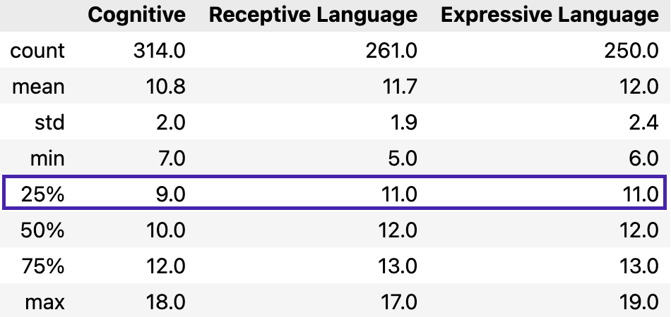

# **Using Fetal Thalamus Ultrasound to Predict Neurodevelopmental Outcomes, Machine Learning Approach**

## **Project Overview**
This project explores the relationship between fetal thalamic ultrasound echogenicity and children’s neurodevelopmental outcomes using machine learning (ML). The study aims to predict **cognitive, expressive, and receptive language abilities** in children as assessed by the **Bayley III Scales**. Radiomic features extracted from fetal brain ultrasound images were analyzed using various ML models.

## **Project Goals**
1. Investigate whether **fetal thalamic radiomic features** can predict neurodevelopmental outcomes.  
2. Compare the performance of **normalized vs. unnormalized features**.  
   - *Since the **echogenicity** of ultrasound images can be influenced by machine settings and imaging conditions, the **cerebellum’s echogenicity features** from the same image are used as a reference to normalize the **thalamic features**, ensuring greater consistency and reducing variability across images.*  
3. Explore the impact of adding **thalamic diameter** as an additional feature.

---

## **Link to Repository**
- Preprocessing scripts and notebooks for annotation, extracting echogenicity features, structuring the dataset, and EDA: [**`preprocessing_notebook/`**](https://github.com/Melodymaifafa/fetal-thalamus-neurodevelopment-ml-prediction/tree/main/preprocessing_notebook)  
- Notebooks analyzing raw thalamic radiomic features without normalization: [**`ML_notebooks_with_unnormalized_feature/`**](https://github.com/Melodymaifafa/fetal-thalamus-neurodevelopment-ml-prediction/tree/main/ML_notebooks_with_unnormalized_feature)  
- Notebooks utilizing normalized radiomic features for ML model training: [**`ML_notebooks_with_normalized_feature/`**](https://github.com/Melodymaifafa/fetal-thalamus-neurodevelopment-ml-prediction/tree/main/ML_notebooks_with_normalized_feature)  
- Notebooks that added thalamic diameter as an additional feature: [**`ML_notebooks_combined_TD_HCfeature/`**](https://github.com/Melodymaifafa/fetal-thalamus-neurodevelopment-ml-prediction/tree/main/ML_notebooks_combined_TD%3AHCfeature)  
- Results folder contains a summarized performance table and visualizations: [**`results/`**](https://github.com/Melodymaifafa/fetal-thalamus-neurodevelopment-ml-prediction/tree/main/results)

---

## **Workflow**

### **1. Data Collection**
- **Source**: Fetal ultrasound brain images (18–22 weeks gestation) from the Nepean Centre for Perinatal Care.  
- **Bayley III Scores**: Cognitive, expressive, and receptive language development scores.  

**Create targets**:  
- Scores **below the 25th percentile** were labeled as **“development delay”**.  
- Scores **above or equal to the 25th percentile** were labeled as **“normal”**.

    

### **2. Image Preprocessing**
- Manual annotation of the thalamus and cerebellum using **COCO-annotator**.  
- Masks created for radiomic feature extraction.

### **3. Feature Extraction**
- **Library**: PyRadiomics  
- **Features**:
  - First-order statistics  
  - Gray-Level Co-occurrence Matrix (GLCM)  
  - Gray-Level Run Length Matrix (GLRLM)  
  - Gray-Level Size Zone Matrix (GLSZM)  
  - Gray-Level Dependency Matrix (GLDM)

### **4. Machine Learning Models**
Models used:  
- **Logistic Regression**  
- **Random Forest**  
- **SVM**  
- **KNN**  
- **Gradient Boosting**  
- **XGBoost**  
- **Neural Network**

**Hyperparameter Tuning**:  
- Grid-search with cross-validation was applied to optimize the performance of each model.  
- Example hyperparameters tuned: regularization strength, number of neighbors, kernel types, number of estimators, and tree depth.

**Class Imbalance**:  
- Addressed using **SMOTE** to balance the dataset.  

**Evaluation Metrics**:  
- Accuracy, Precision, Recall, F1-Score, and AUC.  

---

## **Main Findings and Insights**

    

### **1. Fetal Thalamic Radiomic Features as Predictive Biomarkers**
- Machine learning models demonstrated that **fetal thalamic radiomic features** have the potential to predict neurodevelopmental outcomes.  
- The highest AUC scores achieved are:
- 

    
    

  - **Cognitive Ability**: **0.71** (KNN with normalized features) 
  - **Expressive Language Ability**: **0.70** (Logistic Regression with normalized features)  
  - **Receptive Language Ability**: **0.66** (Random Forest with unnormalized features)  

This indicates that variations in fetal thalamic echogenicity are associated with neurodevelopmental delays.

### **2. Impact of Normalized vs. Unnormalized Features**
- **Normalization**: Thalamic radiomic features were normalized using the **cerebellum features** as a reference.  
- Results:
  - **Cognitive Ability**: AUC improved from **0.68** to **0.71**.  
  - **Expressive Language**: AUC improved from **0.66** to **0.70**.  
- **Insight**: Normalizing features reduces noise caused by inconsistent echogenicity.  
- **Exception**: For receptive language, unnormalized features performed better (AUC: **0.66** vs. **0.58**).

### **3. Thalamic Diameter Adds No Predictive Value**
- Adding **thalamic diameter** did not improve model performance, aligning with prior findings.

    

### **4. Challenges and Limitations**
- **Low Feature Correlations**: The highest Pearson correlation between features and scores is ~0.15, indicating a subtle relationship.

  

  

- **Small Dataset**: Limited to **315 images** with few positive cases.  
- **Manual Annotation**: Potential variability in ROI labeling.  

### **5. Future Directions**
- Increase dataset size and annotation quality.  
- Explore deep learning for automatic feature extraction.  
- Combine radiomic features with other biomarkers to improve predictive performance.

---

## **Dependencies**
- Python 3.x  
- PyRadiomics  
- Scikit-learn  
- Pandas  
- NumPy  
- Matplotlib  
- SMOTE (imbalanced-learn)

---

## **Contributors**
- **Jingtong Qi** | University of Sydney  
- **Supervisors**: Prof. Ralph Nanan, Prof. Jinman Kim  

---

## **License**
[MIT License](LICENSE)
